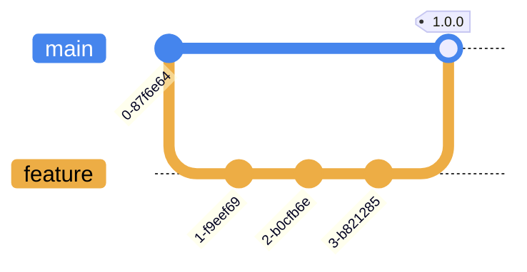

# physical-media-backup-terraform

Infrastructure code for the provisioning of object storage for physical media backups (CD-ROM, DVD-ROM, and floppy disk).

## Overview

An S3 bucket is provisioned, along with an IAM user with suitable policy and credentials, for use with client applications such as [WinSCP](https://winscp.net/eng/index.php) and [Cyberduck](https://cyberduck.io/).

Data is encrypted at rest using [server-side encryption](https://docs.aws.amazon.com/AmazonS3/latest/userguide/UsingServerSideEncryption.html) with Amazon S3 managed encryption keys (SSE-S3). Server-side encryption with AWS Key Management Service (AWS KMS) keys (SSE-KMS) or customer-provided keys (SSE-C) is explicitly blocked via an S3 bucket policy—by denying `PutObject` requests with the `aws:kms` header—to ensure that objects in the S3 bucket use the same server-side encryption method (i.e. SSE-S3).

## Branching Strategy

This project uses a trunk-based branching strategy and infrastructure changes are versioned and applied from the `main` branch after merge via the [infrastructure pipeline](https://github.com/companieshouse/ci-pipelines/blob/master/pipelines/platform/team-platform/physical-media-backup-terraform):

## License

This project is subject to the terms of the [MIT License](/LICENSE).
